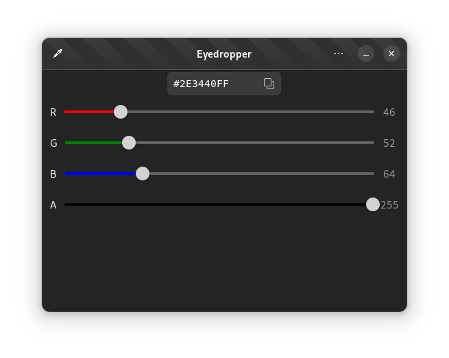

[](https://github.com/FineFindus/eyedropper/actions/workflows/ci.yml)


# Eyedropper

An easy-to-use color picker and editor.

## Features

- Pick a Color
- Edit a color using hex values or RGBA Sliders
- Parse RGBA/ARGB Colors
- View color as RGB, HSV, HSL and CMYK models

### Future Features & Roadmap

- Generate a palette of similar colors

## Building

See this [general guide](https://wiki.gnome.org/Newcomers/BuildProject) for building the project using GNOME Builder.

Alternatively use this [VS Code Extension](https://marketplace.visualstudio.com/items?itemName=bilelmoussaoui.flatpak-vscode#:~:text=VSCode%20%2B%20Flatpak%20Integration,run%2C%20and%20export%20a%20bundle) for working inside VS Code.

### Building manually

Alternatively, it is possible to build the project manually using `flatpak-builder`.
First install the required sdks:

```sh
flatpak install org.gnome.Sdk//41 org.freedesktop.Sdk.Extension.rust-stable//21.08 org.gnome.Platform//41
```

Then build it using:

```sh
flatpak-builder --user flatpak_app build-aux/com.github.finefindus.eyedropper.Devel.json
```

To run it:

```sh
flatpak-builder --run flatpak_app build-aux/com.github.finefindus.eyedropper.Devel.json eyedropper
```

## Credits

A huge thanks to these projects who served either as an inspiration or as code examples on how to use gtk-rs.

- [GTK Rust Template](https://gitlab.gnome.org/World/Rust/gtk-rust-template)
- [Contrast](https://gitlab.gnome.org/World/design/contrast)
- [Microsoft Color Picker Utility](https://docs.microsoft.com/en-us/windows/powertoys/color-picker) - Inspirations on the design
