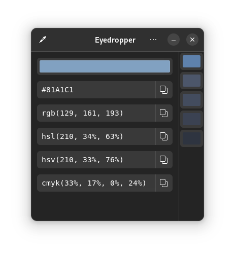
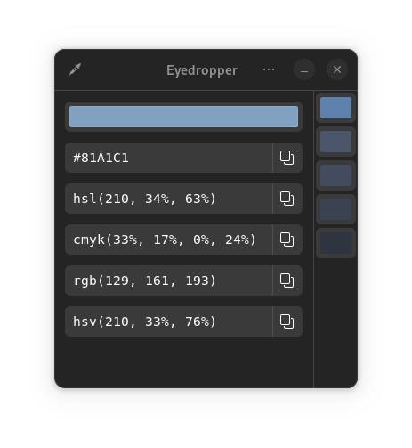
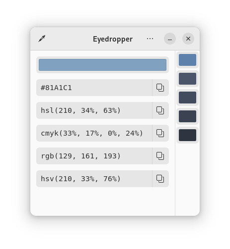
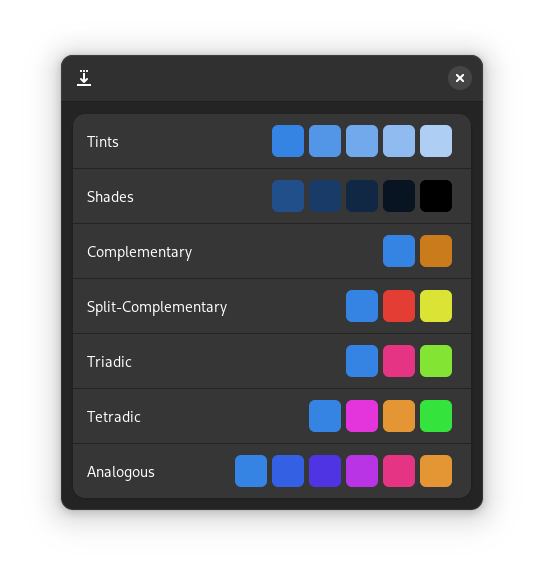
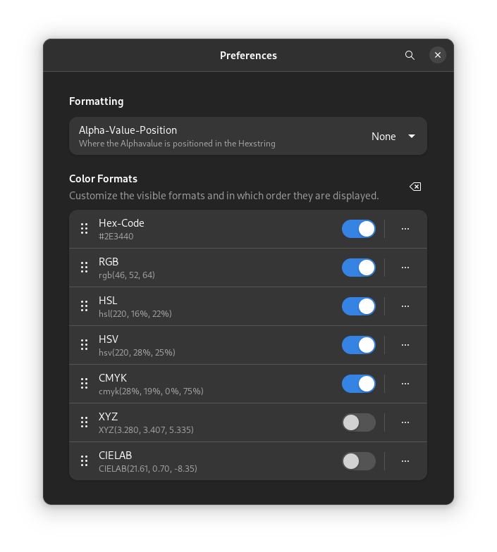

[](https://github.com/FineFindus/eyedropper/actions/workflows/ci.yml)


# Eyedropper

A powerful color picker and formatter.



<details>
  <summary>More screenshots</summary>










</details>

## Features

- Pick a Color
- Enter a color in Hex-Format
- Parse RGBA/ARGB Hex-Colors
- View colors in Hex, RGB, HSV, HSL, CMYK, XYZ and CIE-Lab format
- Customize which formats appear as well as their order
- Generate a palette of different shades

### Future Features & Roadmap

- Generate a palette of similar colors
- Add more color formats

### When should I use this? And when not?

This application is geared towards advanced users (developers, designers, etc…), who not only need to pick a color but also modify or view it in different formats. For simply picking a color on Gnome, the [color-picker extension](https://github.com/tuberry/color-picker) is far better suited.

## Installation

### Official
<a href='https://flathub.org/apps/details/com.github.finefindus.eyedropper'></a>


### Unofficial

> :warning: **These installation methods are not recommended**: Installing them may result in bugs or unexpected behavior.

#### Nightly Flatpak

Download the latest artifact from the [CI](https://github.com/FineFindus/eyedropper/actions/workflows/ci.yml).

#### [AUR](https://aur.archlinux.org/packages/eyedropper)

```sh
yay -S eyedropper
```

#### [AUR Git](https://aur.archlinux.org/packages/eyedropper-git)

```sh
yay -S eyedropper-git
```


## Contributing

Contributors are expected to follow the [GNOME Code of Conduct](https://wiki.gnome.org/Foundation/CodeOfConduct).

Any contributions you make are greatly appreciated. For major changes, please open an issue first to discuss what you would like to change.

To contribute:

1. [Fork the Project](https://github.com/FineFindus/eyedropper/fork)
2. Create your Feature Branch (`git checkout -b feature/AmazingFeature`)
3. Commit your Changes (`git commit -m 'feat: add some AmazingFeature'`)
4. Push to the Branch (`git push origin feature/AmazingFeature`)
5. Open a Pull Request

### Translation

Translations are a great way to contribute. This project uses the [GNU gettext](https://www.gnu.org/software/gettext/manual/html_node/index.html#SEC_Contents) for translations. If you want to learn more, visit the [translator section](https://www.gnu.org/software/gettext/manual/html_node/Translators.html#Translators).

The easiest way to add a translation, is by importing the [`Eyedropper.pot`](po/Eyedropper.pot) file into a program like [Poedit](https://poedit.net) or [Gtranslator](https://gitlab.gnome.org/GNOME/gtranslator/).

After finishing the translations, add the translated language code into the [LINGUAS](po/LINGUAS) file. Then follow the above steps to create a pull request. Please also state in the description if you are willing to maintain the translation.

## Building

See this [general guide](https://wiki.gnome.org/Newcomers/BuildProject) for building the project using GNOME Builder.

Alternatively use this [VS Code Extension](https://marketplace.visualstudio.com/items?itemName=bilelmoussaoui.flatpak-vscode#:~:text=VSCode%20%2B%20Flatpak%20Integration,run%2C%20and%20export%20a%20bundle) for working inside VS Code.

### Building manually

Alternatively, it is possible to build the project manually using `flatpak-builder`.
First install the required sdks:

```sh
flatpak install org.gnome.Sdk//43 org.freedesktop.Sdk.Extension.rust-stable//22.08 org.gnome.Platform//43
```

Then build it using:

```sh
flatpak-builder --user flatpak_app build-aux/com.github.finefindus.eyedropper.Devel.json
```

To run it:

```sh
flatpak-builder --run flatpak_app build-aux/com.github.finefindus.eyedropper.Devel.json eyedropper
```

#### Build without flatpak

```sh
meson --prefix=/usr build
ninja -C build
sudo ninja -C build install
```

## Credits

A huge thanks to these projects who served either as an inspiration or as code examples on how to use gtk-rs.

- [GTK Rust Template](https://gitlab.gnome.org/World/Rust/gtk-rust-template)
- [Contrast](https://gitlab.gnome.org/World/design/contrast)
- [Microsoft Color Picker Utility](https://docs.microsoft.com/en-us/windows/powertoys/color-picker) - Inspirations on the design
- All the other FOSS-GTK apps
